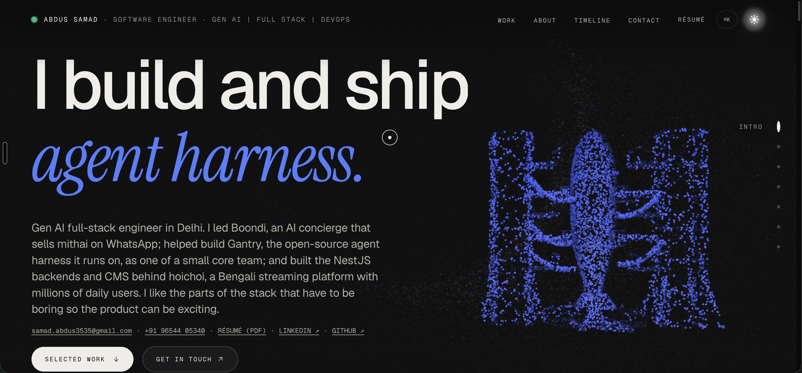
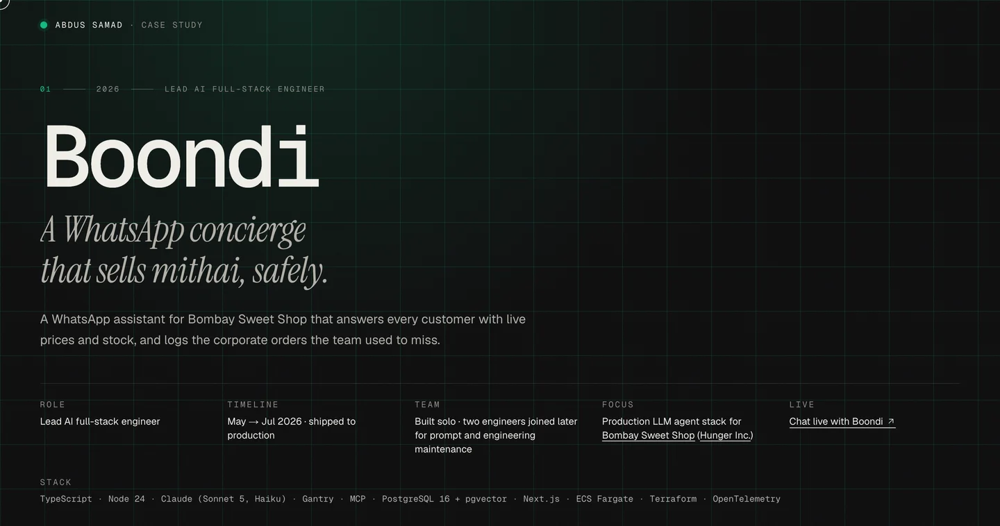
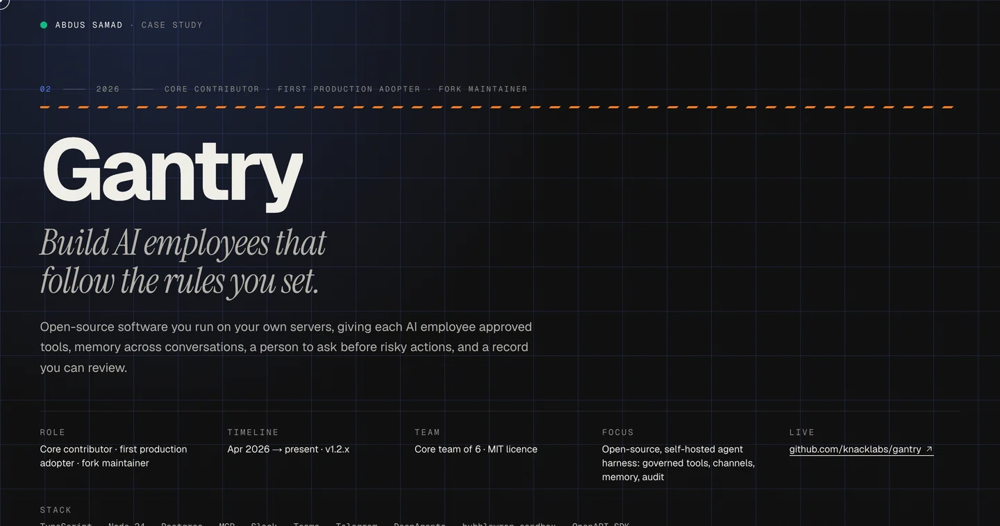
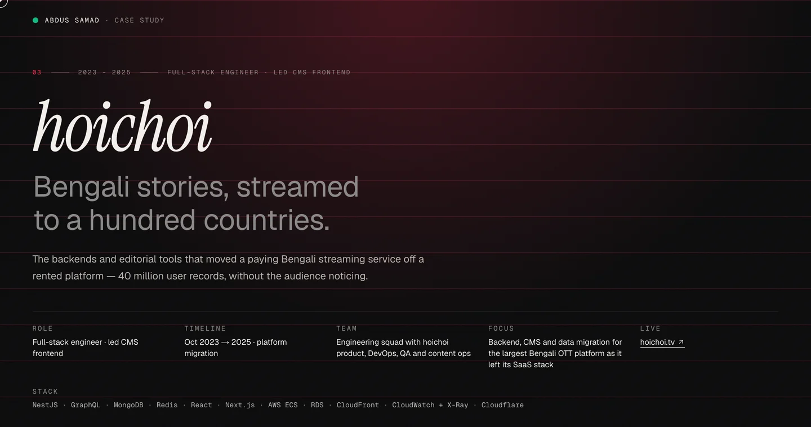
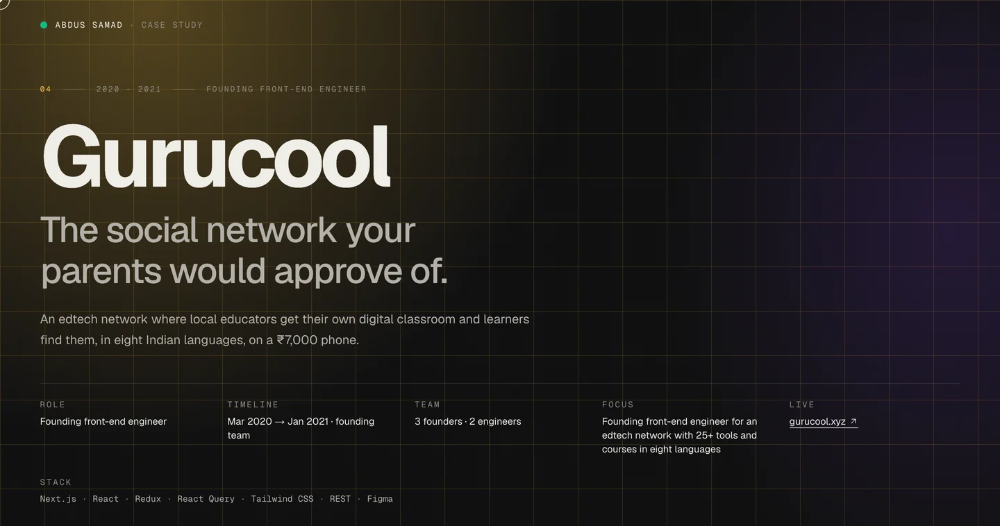

 

**Software Engineer · Gen AI & agentic systems · full-stack Node.js / NestJS · React / Next.js · AWS** 
Delhi, India (IST) · open to remote and relocation · SDE 2 at <a href="https://www.knacklabs.ai/">KnackLabs</a>

 

 

Five years shipping for millions of users, now building production LLM agents. Led **Boondi**, a WhatsApp AI concierge on the Anthropic Claude API and MCP (250+ customer chats a day at $0.02 each), and built the NestJS/GraphQL services behind **hoichoi** (10M+ requests an hour, 40M records migrated with zero critical downtime). I own the whole path: prompts and tool contracts, data model, Terraform, load tests and the dashboards that prove it works.

## Work

<table>
<tr>
<td width="50%" valign="top">

<b>Boondi</b> · WhatsApp AI concierge for Bombay Sweet Shop, built solo on the Anthropic Claude API and MCP: Gantry agent host, two MCP servers, Next.js admin console, PostgreSQL + pgvector, ECS Fargate via Terraform.  
<b>250+</b> customer chats a day · <b>$0.02</b> per conversation · <b>94.6%</b> prompt-cache hit rate · <b>1,200+</b> sales leads in two months · <b>285</b> concurrent turns on real AWS  
<a href="https://asamad.vercel.app/work/boondi">Case study</a> · <a href="https://wa.me/919136192636?text=Hi%20Boondi!">Chat with it</a>
</td>
<td width="50%" valign="top">

<b>Gantry</b> · open-source, self-hosted agent runtime from KnackLabs (MIT). First production adopter: I maintain the production fork Boondi runs on, extended it for a customer-facing agent, and feed capacity findings upstream.  
One permission model across Slack, Teams, Telegram, Discord, SDK and WhatsApp · identity, memory, jobs and audit reused instead of rebuilt  
<a href="https://asamad.vercel.app/work/gantry">Case study</a> · <a href="https://github.com/knacklabs/gantry">Repository</a>
</td>
</tr>
<tr>
<td width="50%" valign="top">

<b>hoichoi</b> · NestJS + GraphQL services on MongoDB for the largest Bengali OTT platform as it left its SaaS stack, plus the content CMS frontend and the migration tooling.  
<b>10M+</b> requests an hour · <b>40M</b> user records migrated at 99.9% uptime · publishing time <b>−50%</b> · CloudWatch spend <b>−70%</b>  
<a href="https://asamad.vercel.app/work/hoichoi">Case study</a> · <a href="https://hoichoi.tv/">hoichoi.tv</a>
</td>
<td width="50%" valign="top">

<b>Gurucool</b> · founding front-end engineer at an edtech network in eight Indian languages: the Next.js app and component library from the first commit, a React Query data layer against a moving backend, and the investor site shipped ahead of deadline.  
The pre-seed round followed · the platform grew to 3,000+ courses  
<a href="https://asamad.vercel.app/work/gurucool">Case study</a> · <a href="https://gurucool.xyz/">gurucool.xyz</a>
</td>
</tr>
</table>

## Stack

## Side projects

- **[Doodle-It](https://github.com/asamad35/Doodle-it)** — Excalidraw-style drawing tool: Next.js canvas app with freehand strokes, Rough.js shapes and undo/redo · [live](https://doodleit.vercel.app/)
- **[Socio Plus](https://github.com/asamad35/socio-plus-frontend)** — MERN social app with real-time chat (Socket.IO), video calls (Agora) and file sharing (GridFS) · [live](https://socio-plus.netlify.app/)
- **[Flight booking](https://github.com/asamad35/flight-booking-frontend)** — Next.js + Supabase flight search and booking, with a [NestJS API](https://github.com/asamad35/flight-booking-backend) · [live](https://flight-booking-frontend-ten.vercel.app)
- **[Scalable chat](https://github.com/asamad35/scalable-chat-app-redis-kafka)** — Socket.IO server scaled out with Redis pub/sub and Kafka in a Turborepo monorepo

 

Open to senior full-stack and applied-AI roles · <a href="https://asamad.vercel.app/resume.pdf">résumé</a> · <a href="mailto:samad.abdus3535@gmail.com">samad.abdus3535@gmail.com</a>

